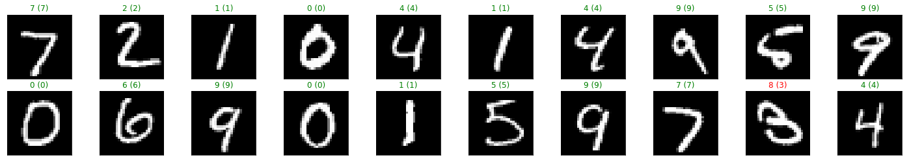

# mnist-mlp-exercise
An MLP to classify images from the MNIST database hand-written digit database using PyTorch.
This model's architecture has Linear layers. To achieve a higher accuracy, Convolution layers
can be used.

# test loss and accuracy for each digit
Test Loss: 0.173844

Test Accuracy of     0: 98% (970/980)  
Test Accuracy of     1: 98% (1118/1135)  
Test Accuracy of     2: 96% (998/1032)  
Test Accuracy of     3: 95% (968/1010)  
Test Accuracy of     4: 97% (955/982)  
Test Accuracy of     5: 96% (865/892)  
Test Accuracy of     6: 97% (935/958)  
Test Accuracy of     7: 97% (1007/1028)  
Test Accuracy of     8: 96% (941/974)  
Test Accuracy of     9: 96% (973/1009)  

# overall accuracy
Test Accuracy (Overall): 97% (9730/10000)

# sample predictions

